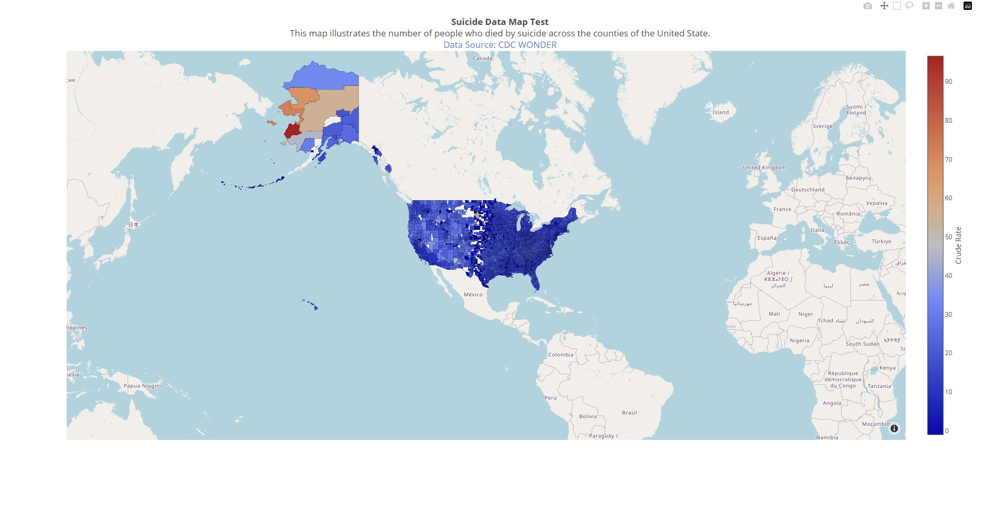

# Map Testing
Map Illustrating the Suicide Rate in U.S. Counties

## Notes
It's very important that when exporting the CDC file you check the boxes "Show Zero Values" and "Show Suppressed Value." If you do not it will omit the counties that "Suppressed" or "Missing" data giving the illusion of missing data in the plot.

## Helpful Doc Finds
- [Plotly React Component Props](https://github.com/plotly/react-plotly.js#basic-props)
- [The reason we can't use the WONDER API](https://wonder.cdc.gov/wonder/help/WONDER-API.html#:~:text=More%20about%20WONDER%20API%20queries%3A)
- [An example WONDER API request body](https://wonder.cdc.gov/wonder/help/API-Examples/D76_Example1-req.xml)
- [CDC WONDER Dataset D76 (you can create an export file here to be used in the Python script)](https://wonder.cdc.gov/ucd-icd10.html)
- [Plotly docs for Choropleth Charts](https://plotly.com/python/county-choropleth/)
- [Plotly docs for Mapbox Chorpleth Charts](https://plotly.com/javascript/mapbox-county-choropleth/)
- [Plotly Chart Colorscales](https://plotly.com/javascript/colorscales/)
- [Plotly Click Events (Also see the React component docs)](https://plotly.com/javascript/click-events/)