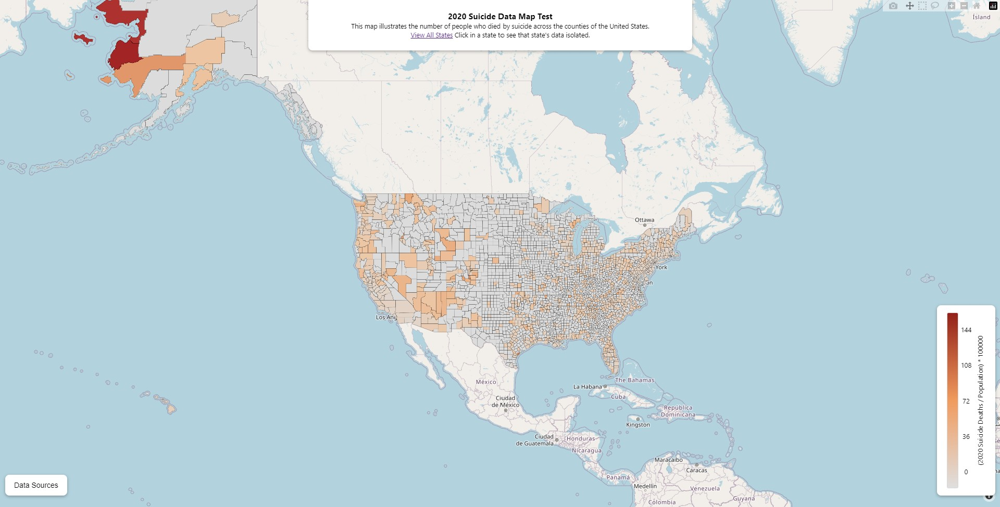
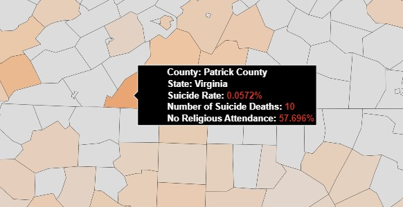
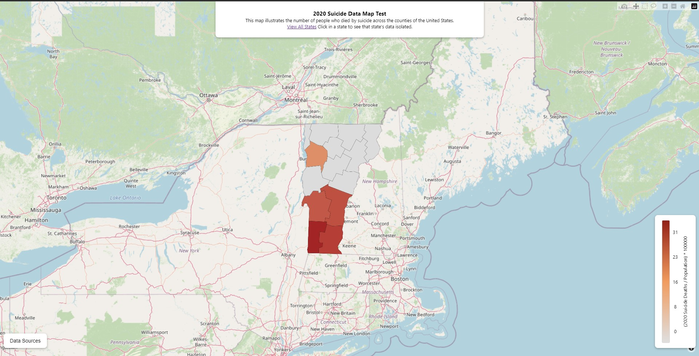

**Are you thinking about killing yourself?** Talk to someone in the U.S. by calling or texting ```988``` or [talk to someone in your country](http://www.suicide.org/hotlines/international-suicide-hotlines.html).


# Suicide Rate Map Explorer
This project is a map illustrating the suicide rate of U.S. counties alongside religious attendance rates. [Some research suggests](https://www.hsph.harvard.edu/news/press-releases/regularly-attending-religious-services-associated-with-lower-risk-of-deaths-of-despair/) there is a corelation, this map was built to help identify areas with the greatest need.



## Explore the Data
The data is separated by county and shaded based on the counties' suicide rate. 



You can click a county to isolate the county's state on the map. Here's Vermont being shown:



To get back to the full map simply press "View All States" from the header. You can share an individual state view's URL with collegues and even modify where the map initially positions itself via the URL parameters: ```https://suicide-rate-map-explorer.pages.dev/state/12?n=29.234052321428567&w=-82.00889428571429&zoom=5```

## Development Notes
It's very important that when exporting the CDC file you check the boxes "Show Zero Values" and "Show Suppressed Value." If you do not it will omit the counties that "Suppressed" or "Missing" data giving the illusion of missing data in the plot.

## Helpful Doc Finds
- [Plotly React Component Props](https://github.com/plotly/react-plotly.js#basic-props)
- [The reason we can't use the WONDER API](https://wonder.cdc.gov/wonder/help/WONDER-API.html#:~:text=More%20about%20WONDER%20API%20queries%3A)
- [An example WONDER API request body](https://wonder.cdc.gov/wonder/help/API-Examples/D76_Example1-req.xml)
- [CDC WONDER Dataset D76 (you can create an export file here to be used in the Python script)](https://wonder.cdc.gov/ucd-icd10.html)
- [Research on dealing with censored data](https://www.cdc.gov/pcd/issues/2019/18_0441.htm)
- [Plotly docs for Choropleth Charts](https://plotly.com/python/county-choropleth/)
- [Plotly docs for Mapbox Chorpleth Charts](https://plotly.com/javascript/mapbox-county-choropleth/)
- [Plotly Chart Colorscales](https://plotly.com/javascript/colorscales/)
- [Plotly Click Events (Also see the React component docs)](https://plotly.com/javascript/click-events/)